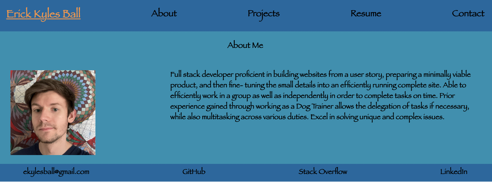

# React Portfolio

## Description
This project creates a portfolio of myself using React. It contains an about-me section, top projects, a resume link and skillset, and a page to contact me.   

        
## Table of Contents
* [Installation](#install)
* [Usage](#usage)
* [Questions](#questions)   

         
## <a name="install"> Installation </a>
Go to http://ekball.github.io/C20-React-Portfolio   
 
## <a name="usage"> Usage </a>
Present information about myself using React for future employers   
      
## <a name="questions"> Questions? </a>
GitHub Link: **[ekball](https://github.com/ekball/)**   
Email Address: <ekylesball@gmail.com>

## Demo React Portfolio
